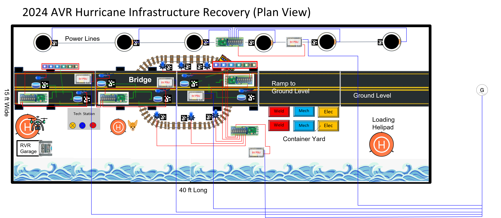

# AVR Smart Court Field Controls

This repository contains the software stack for the AVR Infrastructure Recovery "smart court" field system.

The system is a distributed Raspberry Pi + Arduino architecture that simulates and scores post-hurricane infrastructure recovery missions across railways, bridges, and power lines. A central controller Pi hosts the game model and operator UI, while field Pis in structures (bridge, laser sites, hotspots, etc.) handle relays, NeoPixels, and laser detector events.



## Purpose


This codebase implements the smart-court infrastructure layer:
- event ingestion from field hardware,
- phase/state progression,
- automated scoring aggregation,
- real-time operator visibility,
- and fleet deployment tooling.

For official game definitions and full scoring semantics, refer to the AVR game manual (Infrastructure Recovery 2024, dated 2024-11-25).

## System Architecture

```text
                        +-------------------------------------------+
                        |             Controller Pi                 |
                        |-------------------------------------------|
                        |  controller (state machine + scoring)     |
                        |  mosquitto (MQTT broker)                  |
                        |  nodered (web dashboard / controls)       |
                        +------------------+------------------------+
                                           |
                                   MQTT event backbone
                                           |
        -------------------------------------------------------------------
        |                  |                    |                        |
+----------------+ +----------------+ ... +----------------+  +----------------+
| Building Pi #1 | | Building Pi #2 |     | Building Pi #N |  | Bridge/Pole/etc |
| arduino-adapter| | arduino-adapter|     | arduino-adapter|  | inventory hosts |
+-------+--------+ +--------+-------+     +--------+-------+  +----------------+
        |                   |                      |
   USB serial          USB serial             USB serial
   Arduino Mega        Arduino Mega           Arduino Mega
        |                   |                      |
 laser detectors       laser detectors        laser detectors
 neopixel driving      neopixel driving       neopixel driving
 relay outputs         relay outputs          relay outputs
```

## Component Responsibilities

### Central controller stack (`controller_modules/`)

`controller_modules/docker-compose.yaml` runs:
- `mqtt` (Mosquitto broker)
- `nodered` (operator dashboard)
- `controller` (Python match/scoring engine)

The controller is the central aggregator/brain:
- subscribes to `+/events/#`,
- processes game events and laser hits,
- runs a phased state machine,
- publishes UI state and score,
- publishes relay and NeoPixel commands back to field nodes.

Primary implementation files:
- `controller_modules/controller/src/controller.py`
- `controller_modules/controller/src/match.py`

### Field node stack (`pi/`)

Each field Pi runs `arduino-adapter` (`pi/docker-compose.yaml`):
- reads serial events from an attached Arduino Mega,
- publishes laser hit events to MQTT,
- receives relay/progress-bar commands from controller,
- toggles relay channels and forwards pixel frames to Arduino.

Primary implementation file:
- `pi/arduino-adapter/src/main.py`

### Fleet orchestration (`ansible/`)

Ansible handles provisioning and operations across the Pi fleet:
- inventories define controller and field hosts,
- templates generate per-host configs + compose files,
- playbooks deploy/start/stop/reboot field software.

Primary paths:
- `ansible/inventories/*.yaml`
- `ansible/plays/deploy.yaml`
- `ansible/plays/start_all.yaml`
- `ansible/plays/stop_all.yaml`
- `ansible/plays/provision.yaml`
- `ansible/plays/reboot.yaml`

## MQTT Backbone

### Field -> Controller
- `<id>/events/laser_detector_1/` `{ "event_type": "hit" }`
- `<id>/events/laser_detector_2/` `{ "event_type": "hit" }`

### Controller -> Field
- `<id>/relay/set` `{ "channel": <int>, "state": "on"|"off" }`
- `<id>/progress_bar/set` `{ "pixel_data": [[r,g,b], ...] }`

### UI / Operator topics
- inbound commands/events: `ui/events/`
- published state: `ui/state/...`

Common state topics:
- `ui/state/match_state`
- `ui/state/score`
- `ui/state/phase_remaining`
- `ui/state/match_remaining`
- `ui/state/bridge/damaged_spots`
- `ui/state/railroad/damaged_spots`
- `ui/state/powerlines/damaged_spots`

## Game Progression (Implementation)

The match engine in `match.py` uses these states:
- `idle_state`
- `staging_state`
- `phase_1_state`
- `phase_2_state`
- `phase_3_state`
- `phase_4_state`
- `post_match_state`

Representative control events from UI/MQTT:
- `new_match_event`
- `randomize_everything_event`
- `match_start_event`
- `match_end_event`
- `reset_match_event`

Mission progression implemented by the phased model aligns with Infrastructure Recovery flow:
- Mission 1 (Phase 1, 1:00): Railway survey and repair.
- Mission 2 (Phase 2, 1:30): Bridge reconstruction and crack repair.
- Mission 3 (Phase 3, 1:00): Power stabilization and transformer reset workflow.
- Mission 4 (Phase 4, 1:30): Bonus return-home logistics (vehicles/technicians/toolboxes).

Scoring is computed per mission/phase (`m1_*`, `m2_*`, `m3_*`, `m4_*` groups) and rolled into total score.

Phase duration config lives at:
- `controller_modules/controller/configs/config.json`

## Inventory and Field Mapping

Host definitions live in Ansible inventories (for example `ansible/inventories/court_1.yaml`):
- `CONTROLLER` is the central controller Pi.
- numeric hostnames (`"1"`, `"2"`, etc.) are field node IDs and match MQTT topic prefixes.
- comments in inventory indicate physical court location roles (laser buildings, hotspot buildings, etc.).

## Containerized Deployment Model

This system is containerized across the fleet:
- controller Pi: controller + broker + Node-RED containers,
- field Pis: arduino-adapter container.

Field deploys typically use prebuilt image tarballs from `exports/` loaded remotely by Ansible.

## Operations

### Local controller bring-up
```bash
cd controller_modules
docker compose up --build
```
Node-RED UI: `http://localhost:1880`

### Local field adapter bring-up
Create `pi/configs/config.json` with per-node values, then:
```bash
cd pi
docker compose up --build
```

### Fleet provision/deploy/start
```bash
cd ansible
ansible-playbook plays/provision.yaml -i inventories/<inventory>.yaml
ansible-playbook plays/deploy.yaml -i inventories/<inventory>.yaml
ansible-playbook plays/start_all.yaml -i inventories/<inventory>.yaml
```

### Stop fleet
```bash
ansible-playbook plays/stop_all.yaml -i inventories/<inventory>.yaml
```

### Reboot fleet
```bash
ansible-playbook plays/reboot.yaml -i inventories/<inventory>.yaml
```

## Key Paths

- Controller compose: `controller_modules/docker-compose.yaml`
- Controller engine: `controller_modules/controller/src/controller.py`
- Match model/scoring: `controller_modules/controller/src/match.py`
- Node-RED flows: `controller_modules/nodered/data/flows.json`
- Field adapter: `pi/arduino-adapter/src/main.py`
- Ansible inventories: `ansible/inventories/*.yaml`
- Ansible plays: `ansible/plays/*.yaml`
- Deployment artifacts: `exports/*.tar`
